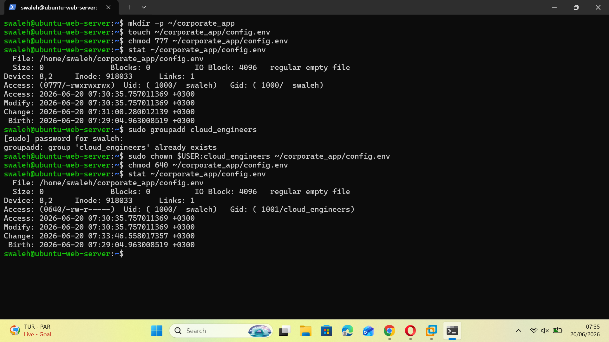
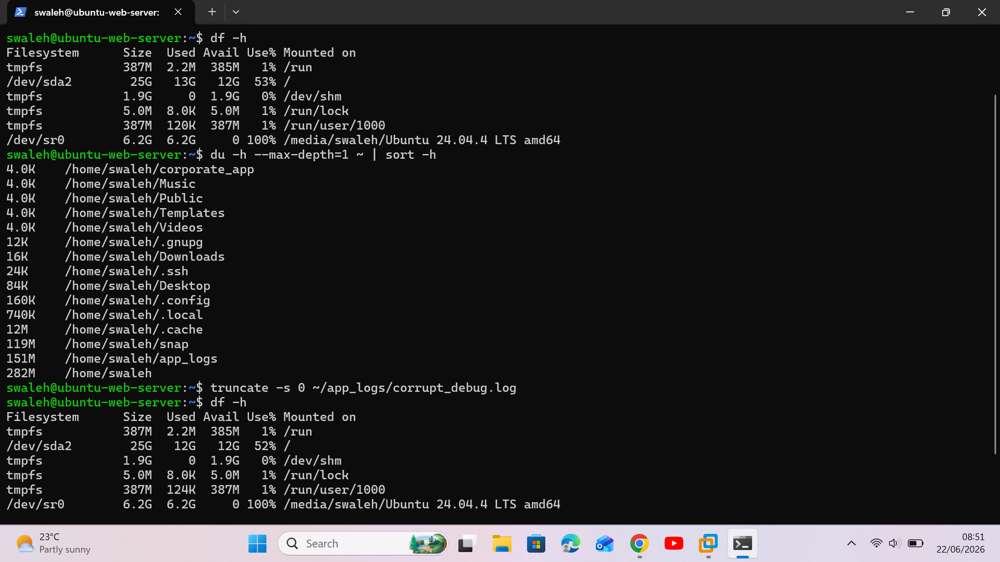
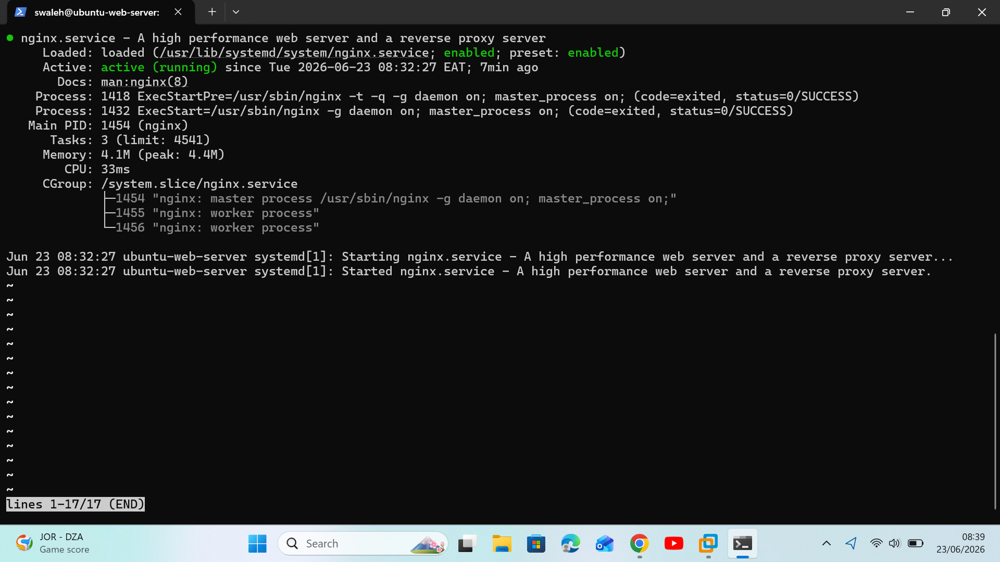
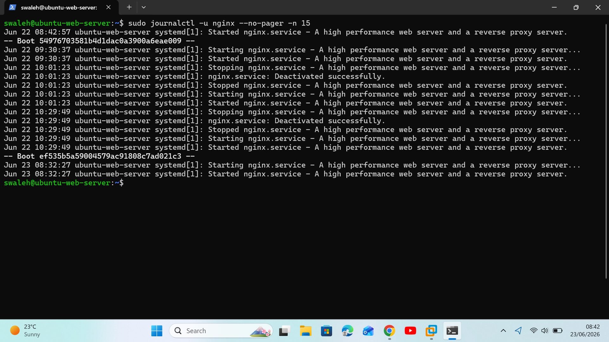
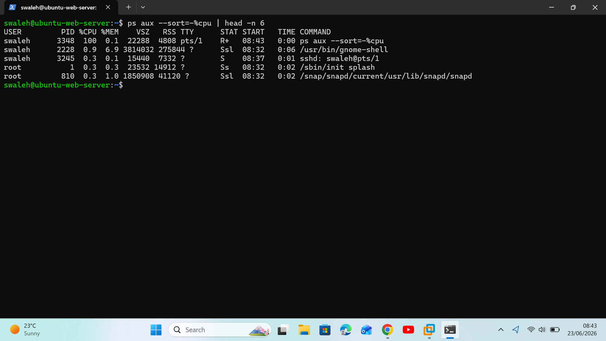
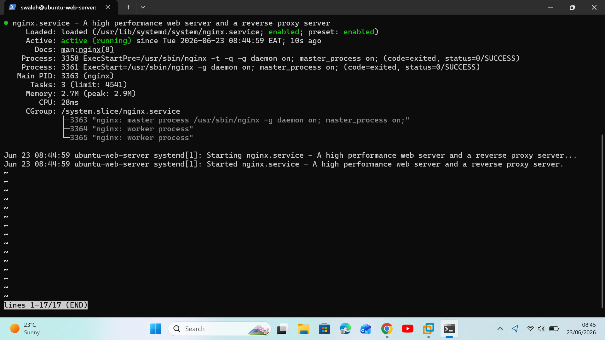

#  Enterprise Linux Troubleshooting & Diagnostics Portfolio

Welcome to my systems engineering ledger. This repository documents real-world production system failures, security vulnerabilities, and network infrastructure incidents diagnosed and resolved as an aspiring Cloud Support Associate. 

Every case study outlines empirical system logs, manual diagnostic pipelines, and structural remediations utilizing the industry-standard STAR framework.

---

##  Incident 01: Identity Access Management (IAM) & File Permission Remediation

* **Situation:** A critical security audit flagged a high-severity compliance violation on the corporate Web Server (`192.168.54.128`). A sensitive application configuration file containing production database credentials (`config.env`) was found misconfigured with world-writable permissions (`777`), exposing secret keys to unprivileged system users.
* **Task:** Act as the Cloud Support Associate to isolate the file's access parameters, establish a dedicated administrative group identity boundary, remediate permissions utilizing the Principle of Least Privilege (PoLP), and manually verify the secure state.
* **Action:**
  1. Audited the exposure parameters using the core file status utility:  
     `stat ~/corporate_app/config.env`
  2. Provisioned a dedicated security administrative boundary group for authorized personnel:  
     `sudo groupadd cloud_engineers`
  3. Re-assigned administrative group ownership away from unprivileged default settings:  
     `sudo chown $USER:cloud_engineers ~/corporate_app/config.env`
  4. Stripped global permissions, restricting access levels down to a hardened operational configuration:  
     `chmod 640 ~/corporate_app/config.env`
* **Result:** Successfully secured production credentials, restricted file access exclusively to verified operations staff, and validated a zero-vulnerability security baseline.

###  Proof of Work
Below is the verified terminal auditing ledger demonstrating the successfully enforced secure permissions state (`0640`).

---

##  Incident 02: Storage Infrastructure Diagnostics & Filesystem Space Remediations

* **Situation:** The monitoring team raised a high-severity alert indicating that the Web Server (`192.168.54.128`) disk utilization hit 100% capacity. The local web applications crashed immediately due to a total lack of available blocks on the storage drive.
* **Task:** Act as the Cloud Support Associate to isolate the storage utilization bottleneck, locate the specific directory consuming the space, identify the rogue file, and clear the system blockades safely.
* **Action:**
  1. Conducted an aggregate volume analysis to evaluate available and consumed filesystem blocks:  
     `df -h`
  2. Executed a targeted human-readable disk usage calculation, sorting directories by size to isolate the root folder stress:  
     `du -h --max-depth=1 ~ | sort -h`
  3. Safely released the locked filesystem blocks without breaking file descriptors utilizing the allocation truncation technique:  
     `truncate -s 0 ~/app_logs/corrupt_debug.log`
* **Result:** Remediated the critical disk space depletion error, restored the server filesystem back to an operational baseline, and verified data integrity.

###  Proof of Work
Below is the verified diagnostic logging showing the storage volumes restored back to normal, unblocked operating thresholds.

---

##  Incident 03: Linux Service Management & Process Telemetry Remediation

* **Situation:** The infrastructure monitoring matrix triggered a critical alert indicating that the primary Nginx web application service on the Web Server (`192.168.54.128`) had entered a failed state, rendering the internal corporate gateway entirely offline.
* **Task:** Act as the Cloud Support Associate to verify the systemd unit failure, extract the internal system daemon logs to identify the root cause of the crash, audit system process telemetry for resource blocks, and safely restore the web environment back to a stable baseline.
* **Action:**
  1. **Unit Triage:** Audited the core systemd unit state configuration to assess the active execution profile:  
     `sudo systemctl status nginx`
  2. **Log Extraction:** Extracted native system journal subsystem records to isolate low-level daemon error logs:  
     `sudo journalctl -u nginx --no-pager -n 15`
  3. **Telemetry Audit:** Evaluated active system process tables sorted by dynamic CPU consumption to locate resource constraints or parent/child execution hangs:  
     `ps aux --sort=-%cpu | head -n 6`
  4. **Service Recovery:** Executed service environment initialization controls to cycle the daemon and validated steady-state recovery:  
     `sudo systemctl restart nginx`

### Proof of Work (Step-by-Step Diagnostics)

#### Step 1: Initial Service Status Assessment

#### Step 2: Systemd Daemon Log Extraction

#### Step 3: Process Telemetry & Resource Audit

#### Step 4: Final Service Recovery Validation

